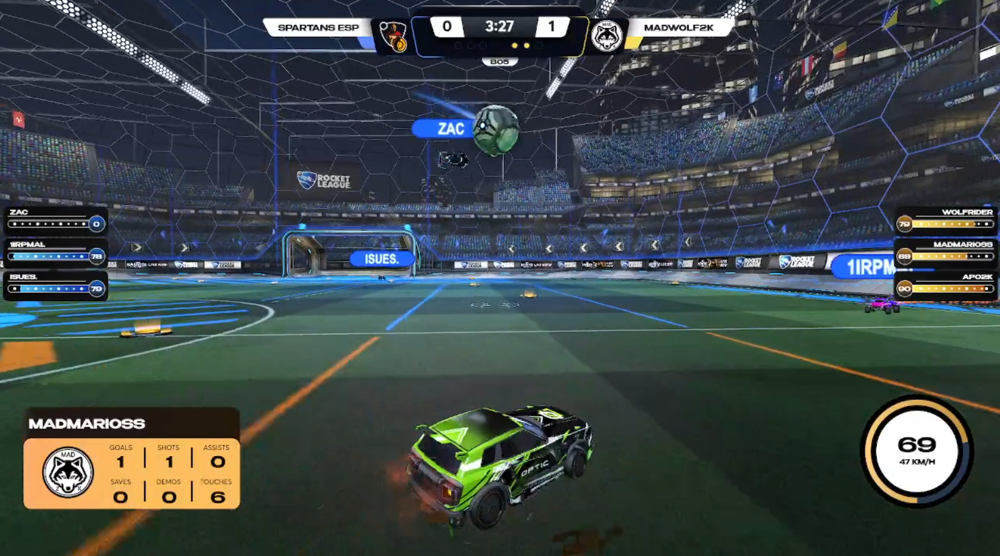
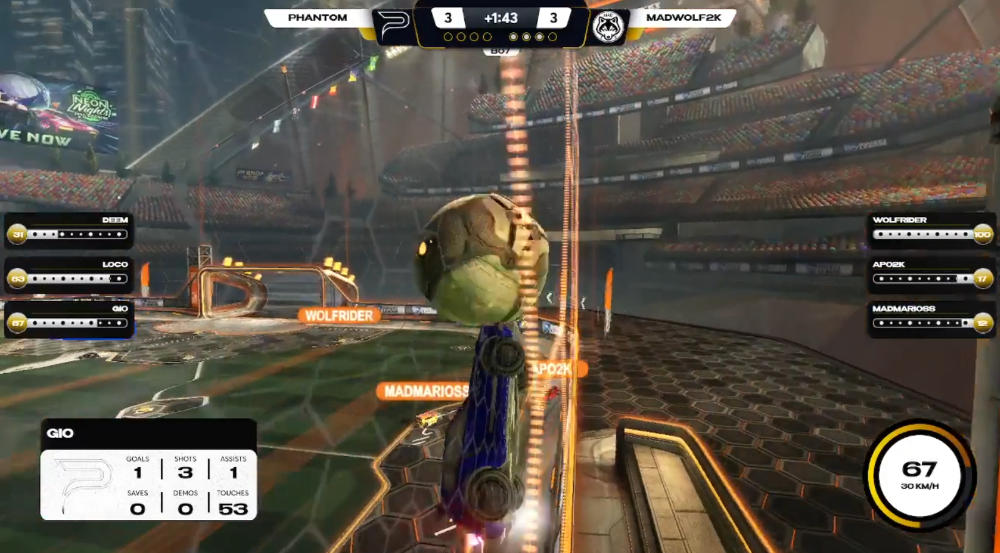
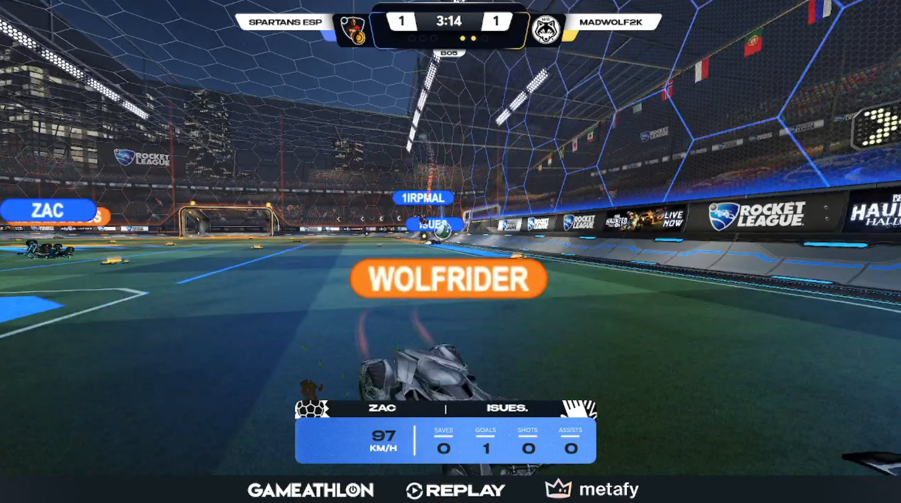

# Pantheon League Overlay (Bootstrap)

A lightweight set of HTML/CSS/JS overlays for the final version of the **Pantheon League** broadcasts and playoffs. Designed to be added to OBS as Browser Sources and driven by simple JSON files and a small WebSocket relay.

---

## Prerequisites

* **OBS Studio**
* **Bakkes mod**
* **SOS ws relay master plugin** 
* **Node.js** (LTS) for the WebSocket relay
---

## Quick start (local)

1. **Clone the repo**

   ```bash
   git clone https://github.com/BronzeKennen/BootStrap-Pantheon-League-Overlay.git
   cd BootStrap-Pantheon-League-Overlay
   ```

2. **Start the WebSocket relay**

   ```bash
   cd sos-ws-relay-master
   npm install   # first run
   node ws-relay.js
   ```

   The relay will listen on `ws://localhost:port` (default defined in `ws-relay.js`).

3. **Add Browser Sources in OBS**

   * **In‑game / 3v3 overlay:** add `overlay3v3.html` (local file path) as a Browser Source.
   * **Show open / match day:** add `matchday.html` as a Browser Source.
   * **Now playing:** add `currentmatch.html` as a Browser Source.

4. **Feed data**

   * Edit `livematch.json` during a game. The overlay will poll/read or receive pushed updates via the relay.
   * After a game, update `matchwinner.json` to trigger the winner visuals.
   * Keep `/stats` up to date with team/player info used by scenes.

> **Tip:** If you prefer a UI instead of editing JSON by hand, try the included `Ta Koumpia.exe` control tool on Windows.

---

## Data model (example)

> Exact keys may differ—adjust to your production needs.

```json
{
  "mode": "3v3",
  "series": "BO5",
  "game": 3,
  "blue": { "name": "Team A", "score": 1 },
  "red":  { "name": "Team B", "score": 1 },
  "timer": "03:42",
  "status": "live"
}
```

`matchwinner.json` example:

```json
{ "winner": "Team A", "method": "2-0" }
```

---

## Customization

* **Branding:** replace images in `/Assets` with your tournament’s logos, backdrops, and icons.
* **Colors & typography:** edit `style.scss` and recompile to `style.css` with any SCSS tool:

  ```bash
  # from repo root
  npx sass style.scss style.css --watch
  ```
* **Layouts:** adjust the HTML scene files (`overlay3v3.html`, `matchday.html`, `currentmatch.html`).
---
## Preview








---

## Troubleshooting

* **Overlay shows blank:** check that the Browser Source has access to local files and that `style.css` is present next to the HTML.
* **No live updates:** verify the relay is running and the overlay’s WebSocket URL matches the relay port.
* **Fonts look wrong:** confirm fonts are installed on the streaming PC or embedded via @font‑face.
* **Stale data:** make sure you’re updating the correct `*.json` files referenced by the scene.

---
